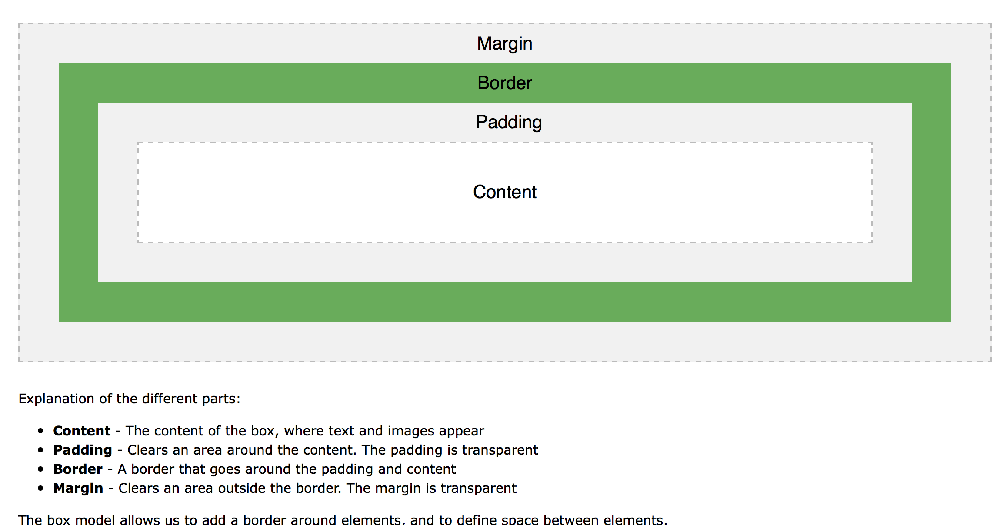

# Design Fundamentals

##  Density Independent Pixels
- Screen resolution is the number of pixels on the screen
- Density independent pixels allow designer to design assets that appear in an expected way
- 1 dp is equal to 1 pixel at 160 dpi
- Density buckets
	- LDPI 120 dpi
	- MDPI 160 dpi
	- HDPI 240 dpi
	- XHDPI 320 dpi
	- XXHDPI 480 dip
	- XXXHDPI 640 dpi
- Provides assets for all 4 if possible but if  only one, provide the higher density assets
	- Tools to do this - [Android Asset Studio](https://romannurik.github.io/AndroidAssetStudio/)


## Resources
- Resource identifiers - see [Providing Resources | Android Developers](https://developer.android.com/guide/topics/resources/providing-resources.html)
- State list drawables  change their appearance based on what state they are in
	- Example: checked or pressed
	- Use different resources based on state
	- Define in `res/drawable` or `res/color`

**Example:**  
*res/colors/button_text.xml*
```xml
<?xml version="1.0" encoding="utf-8"?>
<selector xmlns:android="http://schemas.android.com/apk/res/android">
    <item android:state_pressed="true"
        android:color="#ffffffff"/> <!-- pressed -->
    <item android:color="#ff000000"/> <!-- default -->
</selector>
```

*res/colors/button_color.xml*
```xml
<?xml version="1.0" encoding="utf-8"?>
<selector xmlns:android="http://schemas.android.com/apk/res/android">
    <item android:state_pressed="true"
        android:color="@color/colorPrimaryDark"/> <!-- pressed -->
    <item android:color="@color/colorPrimary"/> <!-- default -->
</selector>
```

*activity_main.xml*
  ```xml
  <Button
      android:layout_width="wrap_content"
      android:layout_height="wrap_content"
      android:layout_gravity="center_horizontal"
      android:backgroundTint="@color/button_color"
      android:padding="10dp"
      android:text="@string/state_button"
      android:textColor="@color/button_text" />
```


## Box Model

  

**Note: adding padding increases the touch area while adding margin does not**

### Layouts
- We've mostly been using `LinearLayout`
- We've also used a `FrameLayout` which allows items to overlap
- Other layouts we didn’t cover include [ViewPager](https://developer.android.com/training/implementing-navigation/lateral.html),  [CardView](https://developer.android.com/guide/topics/ui/layout/cardview.html) and [Constraint Layout](https://developer.android.com/training/constraint-layout/index.html)
- For more information on using Constraint Layout see:
	- [Building interfaces with ConstraintLayout](https://medium.com/google-developers/building-interfaces-with-constraintlayout-3958fa38a9f7)
	- [Using Constraint Layout | Google Codelabs](https://codelabs.developers.google.com/codelabs/constraint-layout/#0)

## Themes and styles
- A style changes the appearance of a single UI element
- A theme applies a collection of styles to an element  or an activity
- Both are defined in `res/values/styles.xml`
- Apply to elements using the `style` tag in the layout
- [Styles and Themes | Android Developers](https://developer.android.com/guide/topics/ui/look-and-feel/themes.html)

*Style example*
```xml
<style name="TextViewStyle" >
    <item name="android:textSize">20sp</item>
    <item name="android:gravity">center_horizontal</item>
    <item name="android:padding">16dp</item>
    <item name="android:textAppearance">@style/TextAppearance.AppCompat.Medium</item>
</style>

```


## ToolBar
- Toolbar - Horizontal bar containing navigation, title and a menu of actions
- [ App bar](https://developer.android.com/training/appbar/setting-up.html) is a special case of Toolbar
